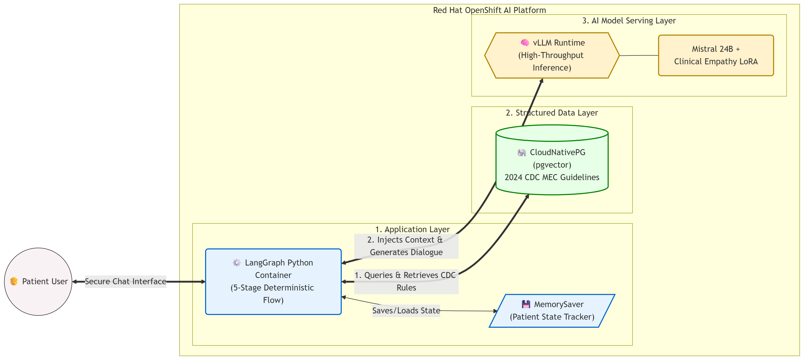
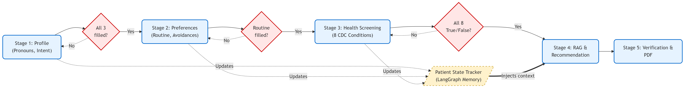

# SARHAchat: Compound AI Medical Triage Assistant

SARHAchat (Sexual and Reproductive Health Assistant) is a proof-of-concept clinical triage and educational chatbot. Built to run on **Red Hat OpenShift AI**, this project demonstrates a "Compound AI System" that enforces deterministic clinical safety guardrails over a fine-tuned generative AI model.

## Why SARHAchat on OpenShift AI?
* **Zero-Hallucination Triaging:** Relies on deterministic Python state-routing rather than "prompt engineering" to prevent the LLM from bypassing critical health screenings or recommending contraindicated methods.
* **Cost-Effective Scale:** Utilizes `vLLM` and dynamic LoRA adapters to serve multiple fine-tuned clinical personas on a single base model, avoiding the non-linear token costs of external APIs.
* **Clinical Auditability:** Every recommendation is grounded in a transparent JSON state tracker and physical CDC rule retrieval.

## Overview

In clinical environments, Large Language Models (LLMs) require strict grounding to prevent medical hallucinations and ensure compliance with established guidelines. SARHAchat achieves this by separating the conversational interface from the clinical decision-making logic:

1. **Inference & Persona (vLLM + LoRA):** The system utilizes `Mistral-Small-24B-Instruct` as the base model. To achieve clinical empathy and proper bedside manner, a low-rank adapter (LoRA) was fine-tuned on nursing transcripts. This adapter is dynamically loaded at runtime using vLLM (`--enable-lora=True`), allowing for rapid persona swapping without deploying multiple heavyweight models.
2. **Deterministic State Routing (LangGraph):** A Python-based state machine controls the conversational flow. The LLM is restricted from generating recommendations until a strict set of patient variables (Preferences, Age, Blood Pressure, Clotting History, etc.) are successfully extracted and verified in the session state.
3. **Structured RAG (Docling + PGVector):** The 2024 CDC Medical Eligibility Criteria (MEC) tables were programmatically parsed using IBM Docling and stored as explicit semantic rules in a CloudNativePG (PostgreSQL + pgvector) database. The LangGraph router forces the LLM to filter recommendations strictly against these retrieved CDC rules.

### Hardware
 
This MVP was developed in AWS demo env with 2 instances of g6e.4xlarge.One GPU is use for fine tuning, deploying, inferencing model. One GPU is assigned to the workbench used to run the application. 

### System Architecture



### State Machine Workflow

The LangGraph application enforces a multi-stage triage process. The model cannot bypass the health screening stages to offer a consultation.



### Repository Structure

```text
.
├── app/                        # Main LangGraph application
│   ├── app_gradio.py           # The Split-Screen Web GUI
│   ├── main.py                 # CLI entry point for the chat loop
│   ├── graph.py                # LangGraph edge/node definitions
│   ├── nodes.py                # LLM invocations and system prompts
│   ├── state.py                # TypedDict for session state variables
│   ├── stage_3_subgraph.py     # CDC health risk extraction logic
│   └── config.py               # Environment and LLM client configuration
├── data/                       # Knowledge base and training assets
│   ├── cdc_mec_tables_only.pdf # Source CDC guidelines
├── fine-tuning/                # Model training scripts
│   └── train_lora.py           # Unsloth/TRL script for Mistral 24B fine-tuning
├── infrastructure/             # Deployment and data ingestion scripts
│   ├── ingest_cdc.py           # Parses PDF via Docling and loads PGVector
│   └── upload_models.py        # Syncs base models and LoRA adapters to MinIO S3
├── assets/                     # Architecture and workflow diagrams
├── requirements-app.txt        # Runtime dependencies (LangGraph, vLLM client)
└── requirements-lora.txt       # Training dependencies (Unsloth, PyTorch)
```
### Workbench Settings

I am using workbench image **Jupyter | PyTorch | CUDA | Python 3.12** and have additional requirements installed in the workbench. Check the requirements files.

## Running the Clinical MVP GUI (Gradio)

While the core LangGraph logic can be tested in the terminal using `main.py`, we have included a fully featured Gradio Web UI designed specifically for clinical and architectural demonstrations.

The GUI features a "Split-Screen" design to prove the auditable nature of our architecture:
* **Left Pane (The Patient View):** A clean chat interface interacting with our LoRA fine-tuned Mistral model.
* **Right Pane (The Architect View):** A live JSON state tracker showing LangGraph strictly extracting clinical variables, plus an expandable module showing the exact 2024 CDC MEC safety rules retrieved via pgvector (RAG).

### How to Launch the GUI
Ensure your virtual environment is active and your OpenShift vLLM instance is running.

1. Navigate to the root of the project directory.
2. Run the Gradio app:
   ```bash
   python app/app_gradio.py
3. Look at the terminal output for the public URL (e.g., https://xxxxxx.gradio.live). 
    Click this link to open the UI in a full-screen, unblocked browser tab.

Note: The Gradio UI includes a share=True flag by default. This safely tunnels the UI through the Jupyter/OpenShift proxy so it can be easily shared during live presentations.

## Next Steps

### Attach Guardrails for Input and Output

### Complete Fine Tuning to Solve General Q & A Mode

This was shared as resource for information to help with questions to our app. https://www.bedsider.org/questions?page=18 this web page has many sample question and answersaround sexual healt. I would suggest using this for training data for supervised fine tuning using training-hub on a small model. Then have this as a chat option to handle general Q & A mode. 

### Add Data Ingestion and Manipulation Pipeline to Automate RAG Setup

Utilize Kubeflow data science pipelines in Opeshift AI.

### Create Custom Image for Dependencies 

## Licensing

This project is licensed under the Apache License 2.0. See the LICENSE file for details.